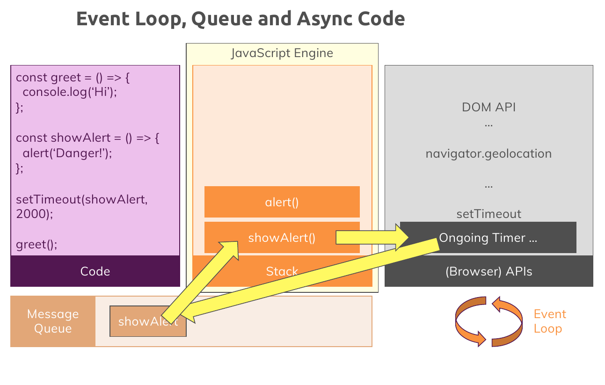
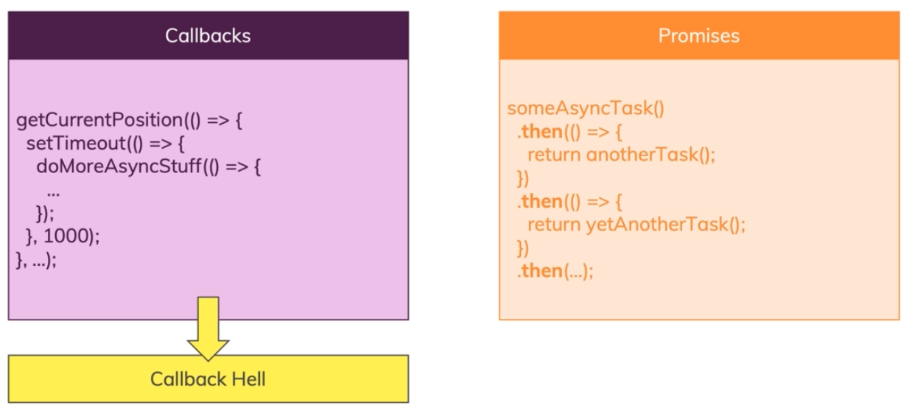
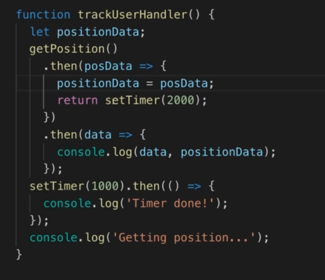

# Asynchronous in Javascript

## Intro

1. First of all , know this that javascript is **single-threaded**. that it !
2. So what is async exactly in javascript ? how can we handle the operations that can take a bit longer than the other and we want to run the rest of the codes asynchronously ?
   **The answer is we can offload them to the browser !** because the browser is able to use multiple threads . one for javascript and one for another task like the async tasks declared in javascript. so the execution is not blocked and the browser is resposnible for executing the async tasks and manage them in multiple threads.
3. How Javascript communicate with browser ? through defining call back functions and work with appropriate API like Browser API with help of Event Loop. **So The Real Magic Is Done By The Browser With Help Of Event Loop !**

## Event Loop

1. Take a Look at this picture:

   

   It is actually the **Event Loop** that helps us with asynchronous codes and let us deal with calback functions which are used in such async codes. note that event loop is not part of javascript engine , it is really part of the host environment of javascript like browser or webserver and etc ...

2. When ever an async task is going to execute for example a timer after a certain amount of time or a response of http request , it will schedule for execution in Message Queue which is provided by the Browser or Host Environment. these messages are like TODO tasks for javascript.

3. What does **Event Loop** really do?
   The job of **Event Loop** in the end is to synchronize the call stack in the engine with our waiting messages. in the end event loop runs basically all the time and it always sees , is the stack empty and do we have pending tasks in queue or TODO Tasks? and if there were any ? it will push any waiting messages or any TODO functions or tasks therefore into the call stack after Javascript engine call stack becomes empty.

## Promise

1. First, take a look at this example to know that what problem do promieses fix :
   

   So what exactly the promise is ?

2. Promise is a cleaner way to use asynchronous tasks and callbacks that really helps us to avoid the **Callback Hell**. We can avoid nesting and implement our step by step guideline instead of step in a step in a step and so on.
3. Promise has 3 states :
   1. Resolve
   2. Reject
   3. Pending
4. How to create Promises ?

   ```javascript
   // resolve and reject are both functions
   const promise = new Promise((resolve, reject) => {
     `a callback function which is executed right away
      when this promise is constructed.
      and it's a way for us to configure what this
      promise should actually do`;

     // some async task
     // like : setTimeOut(() => {...}, timeout)

     setTimeout(() => {
       resolve("someData");
     }, timeout);
   }).then(resolveFunction, rejectFunction);
   // -> data => {...}
   // -> error => {...}
   ```

   Where can this promise be useful ? See the code below:

   ```javascript
   const setTimer = (duration) => {
     const promise = new Promise((resolve, reject) => {
       // put asynchronous task here
       setTimeout(() => {
         resolve("someData");
       }, duration);
     });

     // most important part
     // we return the promise to set the resolve and reject functions
     return promise;
   };

   setTimer(2000).then(
     (data) => {
       console.log(data);
     },
     (error) => {
       console.log(error);
     }
   );
   ```

   Also , for error handling , we can use an alternative too , because passing two callbacks to then method is not the best practice. So we can do this :

   ```javascript
   setTimer(2000)
     .then((data) => {
       console.log(data);
     })
     .catch((error) => {
       console.log(error);
     });
   ```

5. Note that promises are considered as async tasks and what ever they are and how fast they wanna be execute , they will be passed to browser to handle them and Javascript goes for the next lines and codes.

6. Promise Chain :

   

   The core idea of promise chaining is to return another promise in **`.then(...)`** method and declare another **`.then`** method for the returned object which is also a promise and it is creating a chain of promises which we can use to do tasks step by step and avoid nesting the tasks especially asynchronous tasks.
   When you use chaining , the later steps or later then methods will execute if the previous ones has been executed, because it is a chain of promises, if one ring falls , the rest of the rings of the chain will be.

7. Error handling in Promise Chain:

   1. First of all , you need to know that , if in a promise chain , we see an error in for example one of the chains , it directly goes to the **nearest** (nearest from the top or beginning) **`.catch()`** or **second argument error handler** (2 ways of declaring error handlers) and execute that handler function which is **`rejectFunction`** , and ignore the rest of the **`.then()`** methods before the **`.catch()`** or **second argument error handler**.
   2. **But** it will continue to execute the remaining **`.then()`** methods that is comming after that **`.catch()` or second arg error handler**.

   ```javascript
   const prom = setTimer(2000)
                  .then()
                  .then()
                     .
                     .
                     .
                  // go and execute this
                  // if we see an error in the above chains
                  .catch(err => {...})
                  // these methods will also be executed
                  .then()
                  .then()
                     .
                     .
                     .
                  .then();
   ```

   If you wanna make the chain something like if you see an error , the whole chain stops , you should move the **second arg error handler or `.catch()`** to the end of the chain. Like this :

   ```javascript
   const prom = setTimer(2000)
                  .then()
                  .then()
                     .
                     .
                     .
                  .then()
                  .then()
                     .
                     .
                     .
                  .then()
                  .catch(err => {...});
   ```
