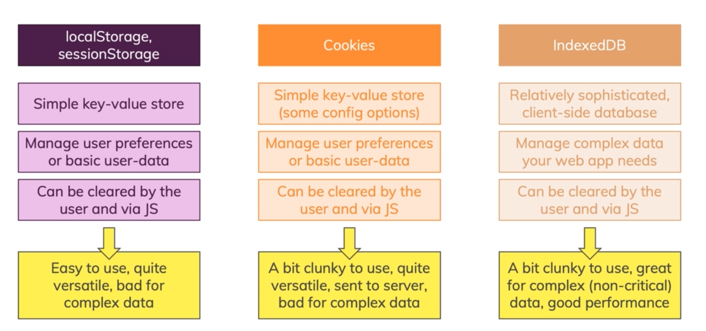

# Browser Storage

1. Take a look at this :
   

2. Cookies unlike Local Storage and Session Storage typically are sent to the server with outgoing HttpRequests and can be read by the server because they are attached to outgoing request in the headers.
