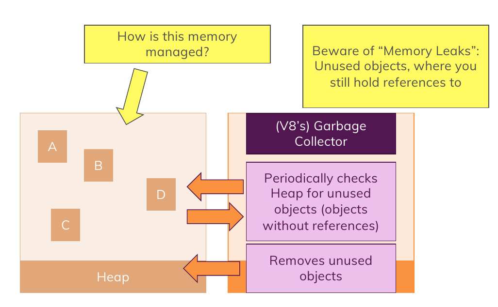

# Javascript Engine Garbage Collector

1. Just try to avoid memory leaks , it means declaring objects without using them , it is very very bad , please avoid it becuase that variable still has a reference to that object value and will not be collected by garbage collector
2. note that garbage collector collects unused objects which means the objects that have no reference to them , take a look at this code sample :

   ```javascript
   let person = { age: 30, name: "mamad" };

   let person = null;

   // in this situation the declared object at first will be collected and removed by garbage collector because it has no reference to it
   ```

To Summary Just Take a Look At This Picture :


