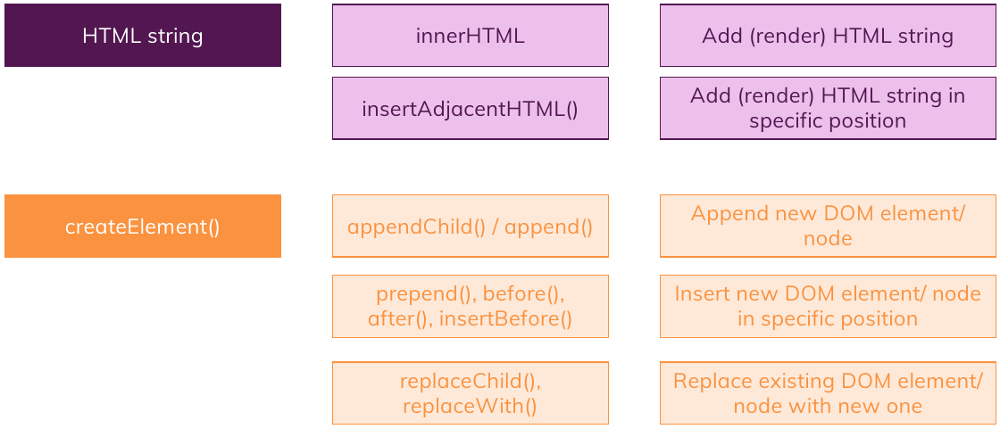
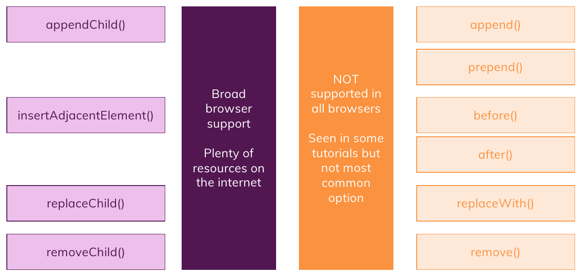

# Creating and Inserting Elements

Take a look at this picture , this picture is the general ways of creating or inserting the elements in the DOM:



But to cut a story short , and for summary of best ways to do this look at this picture :



## Notes For Using These Methods

1. Try to use HTML String Method only when there is no other efficient ways and you wanna replace all the exisiting elements with your desired html element as a string format and the query to find that node is not that much complex to write.

2. You can use **`element.cloneNode()`** to make a clone or a copy of the current selected **`element`**. this method takes one optional argument : **`element.cloneNode(?deep)`** and thats a **boolean parameter which by default** is **`false`** and **simply determines whether a deep clone with all childs and descendant elements or not.**

---

## Summary

There are many ways of creating, inserting, replacing and removing DOM elements - here's a summary of the options you have.

For browser support, check the provided links and also the "Browser Support" module you find later in the course.

### Create & Insert

You got **two** main options:

1. **Provide an HTML snippet** (e.g. via **`innerHTML`**) to a valid HTML snippet and **let the browser render it**
2. **create a DOM object in JS code and append/ insert it manually.** The latter approach has the advantage of giving you direct access to the DOM object (useful for setting its properties or adding event listeners). The downside is that you have to write more code.

#### Adding HTML Code

```javascript
const root = document.getElementById("root-el"); // selects something like <div id="root-el">
root.innerHTML = `<div>
                    <h2>Welcome!</h2>
                    <p>This is all create & rendered automatically!</p>
                  </div>`;
```

**Important**: Any existing content in root is **completely replaced** when using innerHTML. If you want to append/ insert HTML code, you can use **insertAdjacentHTML** instead: [insertAdjacentHTML](https://developer.mozilla.org/en-US/docs/Web/API/Element/insertAdjacentHTML)

```javascript
const root = document.getElementById("root-el"); // selects something like <div id="root-el">
root.insertAdjacentHTML(
  "afterbegin",
  ` <div> <h2>Welcome!</h2> <p>This is all create & rendered automatically!</p> </div>`
);
```

#### Creating & Inserting DOM Objects Manually

```javascript
const someParagraph = document.createElement("p"); // creates a "p" element (i.e. a <p> element)
const root = document.getElementById("root-el"); // selects something like <div id="root-el">
root.append(someParagraph);
```

In this example, we create a paragraph and append it to root - append means that it's inserted at the end of root (i.e. inside of it but AFTER all other child nodes it holds).

##### Insertion Methods

`append()` => [append()](https://developer.mozilla.org/en-US/docs/Web/API/ParentNode/append)

Browser support is decent but for IE, `appendChild()` could be preferred => [appendChild()](https://developer.mozilla.org/en-US/docs/Web/API/Node/appendChild)

`prepend()` => [prepend()](https://developer.mozilla.org/en-US/docs/Web/API/ParentNode/prepend)

Browser support is decent but for IE, `insertBefore()` could be preferred => [insertBefore()](https://developer.mozilla.org/en-US/docs/Web/API/Node/insertBefore)

`before()` , `after()` => [before()](https://developer.mozilla.org/en-US/docs/Web/API/ChildNode/before) & [after()](https://developer.mozilla.org/en-US/docs/Web/API/ChildNode/after)

Browser support is okay but IE and Safari don't support it. Consider `insertBefore()` [insertBefore()](https://developer.mozilla.org/en-US/docs/Web/API/Node/insertBefore) or `insertAdjacentElement()` [insertAdjacentElement()](https://developer.mozilla.org/en-US/docs/Web/API/Element/insertAdjacentElement) as substitutes.

Important (no matter how you insert elements): Whenever you insert elements, you **MOVE** the element to that new place if you already inserted it before. **It's NOT copied** (you can copy an element via **`someElement.cloneNode(true)`** though).

##### Replace

You can replace elements in the DOM with **two** main methods:

`replaceWith()` => [replaceWith()](https://developer.mozilla.org/en-US/docs/Web/API/ChildNode/replaceWith)

`replaceChild()` => [replaceChild()](https://developer.mozilla.org/en-US/docs/Web/API/Node/replaceChild)

`replaceWith()` is a bit easier to use and has decent browser support - with IE being the exception. To support that as well, consider using `replaceChild()`.

##### Remove

You can remove elements with **three** main methods:

`someElement.innerHTML = ''` => Clears all HTML content of someElement and hence removes any objects rendered in there.

`someElement.remove()` => Removes a single element (someElement) from the DOM : [remove()](https://developer.mozilla.org/en-US/docs/Web/API/ChildNode/remove).
Browser support is good, IE again doesn't like it though. **Use removeChild (see below)** instead.

`someElement.parentNode.removeChild(someElement)` => Removes the provided child element (NOT the element on which you call it). Provides broad browser support but of course requires a bit more code [removeChild(someElement)](https://developer.mozilla.org/en-US/docs/Web/API/Node/removeChild).

**What about Text Nodes?**
You can easily create & insert text nodes in one go:

```javascript
someElement.textContent = "Hi there!";
```

This creates and inserts the text node with a content of 'Hi there!'.

**Want to append to existing text?**

Just use:

```javascript
someElement.textContent = someElement.textContent + "More text!";
```
