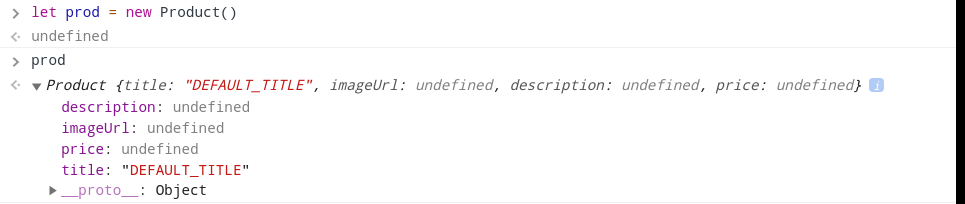
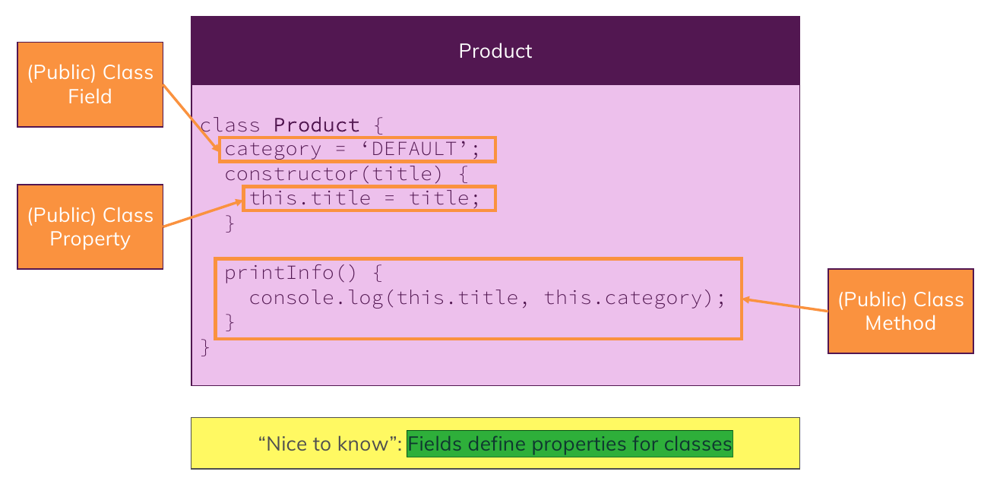

# Object Oriented Programmin in Javascript

## `Class` Keyword

1. Take a look at this sample codes:

   ```javascript
   class Product {
     // you should assign default value to your fields with '=' and end it with ';'
     title = "DEFAULT_TITLE";
     imageUrl;
     description;
     price;

     // adding a method to a class
     someNameMethod() {...}
   }
   ```

   It's just a Blueprint for creating our objects.
   How to use it and create objects ?
   See the following codes:

   ```javascript
   // new syntax -> calling the class like function ('Product()')
   // and put 'new' before to tell the javascript to create objects based on this class
   let prod = new Product(); // this gives us a new Product Instance or Object
   ```

   If you try to invoke **`Product()`** without **`new`** keyword , it will raise an error :

   

   Also, the created object is something like this :

   

2. Constructor Method inside a class :

   **Constructor method** will be called at the **beginning of the creation of the object of that class**
   **we can use it for setting initial values to the properties or fields and do some stuffs for the first time of creating the object**

   ***

   **NOTE** : we call them fields when we are in class context and then , we call them properties when we are in object context and in summary :

   

   > Fields define properties for classes

   ```javascript
   class Product {

     // You can omit these fields
     // and defines them in constructor method

     // title = "DEFAULT_TITLE";
     // imageUrl;
     // description;
     // price;

     someNameMethod() {...}

     // constructor
     constructor(title, imageUrl, desc, price) {
         // this refers to the 'Current Object' that is want to be created
         this.title = title ? title : "DEFAULT_TITLE";
         this.imageUrl = imageUrl;
         this.description = desc;
         this.price = price
     }
   }
   ```

   How to use ? See :

   ```javascript
   let prod = new Product(
     "Mobile Phone",
     "http://...",
     "Brand New Mobile Phone",
     2500
   );
   ```

   in the end , we have always normal javascript objects , it is not something different.

3. Static Methods and Fields in classes :

   ```javascript
   class Product {
     // this is a static field
     static fieldName;

     // this is a static method
     // we can access to this method via class itself
     static myMethod() {
       console.log(this); // this refers to the current 'Class'
     }

     // constructor
     constructor(title, imageUrl, desc, price) {
       // this refers to the 'Current Object' that is want to be created
       this.title = title ? title : "DEFAULT_TITLE";
       this.imageUrl = imageUrl;
       this.description = desc;
       this.price = price;
     }
   }
   ```

   in **Static Methods**, **`this`** refers to the **current class**.

   ***

   How to Use ? , See :

   ```javascript
   Product.myMethod();
   Product.fieldName;
   ```
