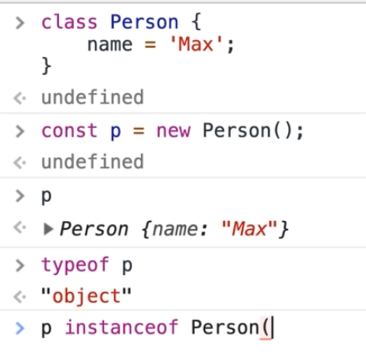

# Object Oriented Programmin in Javascript

## `Class` Keyword

1. Take a look at this sample codes:

   ```javascript
   class Product {
     // you should assign default value to your fields with '=' and end it with ';'
     title = "DEFAULT_TITLE";
     imageUrl;
     description;
     price;

     // adding a method to a class
     someNameMethod() {...}
   }
   ```

   It's just a Blueprint for creating our objects.
   How to use it and create objects ?
   See the following codes:

   ```javascript
   // new syntax -> calling the class like function ('Product()')
   // and put 'new' before to tell the javascript to create objects based on this class
   let prod = new Product(); // this gives us a new Product Instance or Object
   ```

   If you try to invoke **`Product()`** without **`new`** keyword , it will raise an error :

   

   Also, the created object is something like this :

   

2. Constructor Method inside a class :

   **Constructor method** will be called at the **beginning of the creation of the object of that class**
   **we can use it for setting initial values to the properties or fields and do some stuffs for the first time of creating the object**

   ***

   **NOTE** : we call them fields when we are in class context and then , we call them properties when we are in object context and in summary :

   

   > Fields define properties for classes

   ```javascript
   class Product {

     // You can omit these fields
     // and defines them in constructor method

     // title = "DEFAULT_TITLE";
     // imageUrl;
     // description;
     // price;

     someNameMethod() {...}

     // constructor
     constructor(title, imageUrl, desc, price) {
         // this refers to the 'Current Object' that is want to be created
         this.title = title ? title : "DEFAULT_TITLE";
         this.imageUrl = imageUrl;
         this.description = desc;
         this.price = price
     }
   }
   ```

   How to use ? See :

   ```javascript
   let prod = new Product(
     "Mobile Phone",
     "http://...",
     "Brand New Mobile Phone",
     2500
   );
   ```

   in the end , we have always normal javascript objects , it is not something different.

3. Static Methods and Fields in classes :

   ```javascript
   class Product {
     // this is a static field
     static fieldName;

     // this is a static method
     // we can access to this method via class itself
     static myMethod() {
       console.log(this); // this refers to the current 'Class'
     }

     // constructor
     constructor(title, imageUrl, desc, price) {
       // this refers to the 'Current Object' that is want to be created
       this.title = title ? title : "DEFAULT_TITLE";
       this.imageUrl = imageUrl;
       this.description = desc;
       this.price = price;
     }
   }
   ```

   in **Static Methods**, **`this`** refers to the **current class**.

   ***

   How to Use ? , See :

   ```javascript
   Product.myMethod();
   Product.fieldName;
   ```

4. Getters and Setters :

   ```javascript
   class ShoppingCart {
     items = [];

     get totalAmount() {
       const sum = this.items.reduce((prev, curr, items) => prev + curr, 0);
     }

     set cartItems(value) {
       this.items = value;
     }
   }
   ```

5. fields that were defined in a class can only be accessible after the **`super()`** (parent constructor) is called, it means the fields are translated to properties after the **PARENT** constructor ran. otherwise you should pull them into another method , something like **`fetchData`** and set the datas in this function and then try to render items in that. this can be really helpful when you are also working with fetching datas from a server. **(Very Helpful)** , also another approach is try to hold the rendering somehow !
6. If you don't define any constructor method in child classes , it will automatically call parent constructor by default and if you explicitly define a constructor method for the child class , you should always first call **`super()`** which is **parent class constructor method** , otherwise , **it will raise an error.**

7. Encapsulation

   ```javascript
   class ProductList {
     // wanna make private field
     #products = []; // private field

     someMethod() {
       // accessing private field inside of a method
       let prod_list = this.#products;
     }

     // wanna make private methods
     #privateMethodField1 = () => {};

     #privateMethodField2 = function () {};
   }
   ```

8. Pseudo-Private Properties
   The addition of private fields and properties is relatively new - in the past, such a feature was not part of JavaScript.

   Hence you might find many scripts that use a concept which you could describe as "pseudo-private" properties.

   It would look like this:

   ```javascript
   class User {
     constructor() {
       this._role = "admin";
     }
   }

   // or directly in an object

   const product = {
     _internalId: "abc1",
   };
   ```

   **What's that?**

   It's a quite common convention to prefix private properties with an underscore (**`_`**) to signal that they should not be accessed from outside of the object.

   Important: It's just a convention that should signal something! It does NOT technically prevent access. You CAN run this code without errors for example:

   ```javascript
   const product = {
     _internalId: "abc1",
   };
   console.log(product._internalId); // works!
   ```

   It's really just a hint that developers should respect. It's not as strict as the "real" private properties introduced recently (**`#propertyName`**).

9. instanceof Operator

   
