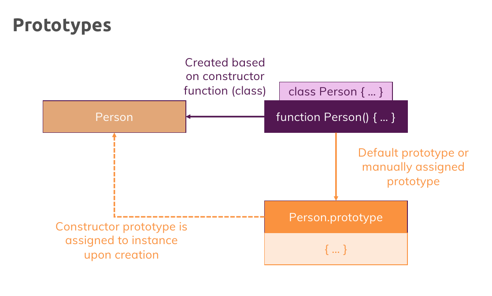
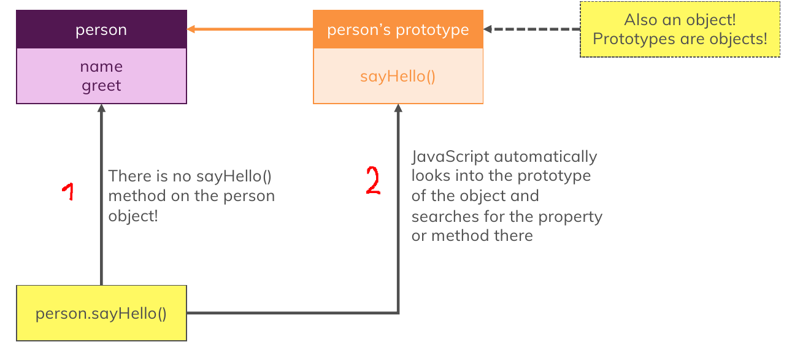
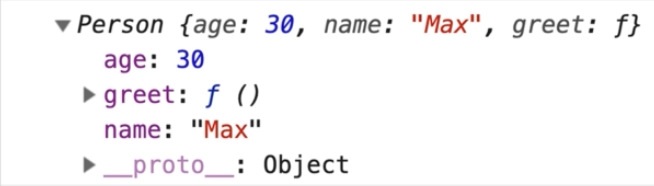
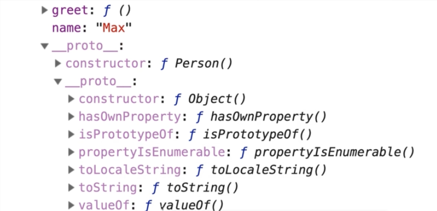

# Prototypes

1. Every constructor function you build has a special prototype peroperty **which is not added to the objects you create based on it** because **it is not** part of the constructor function body **BUT** a property of that **function object** and that prototype is there by default , you can edit it and it is then automatically assigned **as a prototype** to the object when you instantiate that constructor function.

   

2. Prototypes are like **"Fallback Objects"** , and what does it mean ? every object in javascript has a prototype and a prototype is a basically a connected object which is used as a fallback object and this prototype object also has its own prototype object and makes a chain of prototypes

   

   if javascript tries to access a certain method or property and doesn't find it on an object , it automatically looks at the prototype object and looks for the property there and if it doesn't find it there , it looks at the prototype of that prototype, all the way until it reaches the end of that chain and didn't find that property or method , which returns **`undefined`** for properties or raises an **`error`** for methods.

   
   

   Note that the constructor method or the constructor function will be placed into the prototype not the direct properties , i mean **`__proto__`**.
