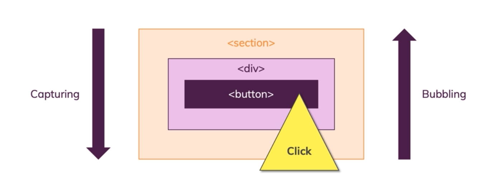

# DOM Events

1. To Add and Remove Event Listeners :

   ```javascript

   const div = document.querySelector("div");

   const callbackfn = () => {...};

   // to add
   div.addEventListener('click' , callbackfn);

   // to remove
   div.removeEventListener('click' , callbackfn)

   ```

   Just know this you should exactly pass the same callback function with the same refrenced value for function object and the same event to perform removing operation.

2. **Capturing** and **Bubbling**

   

   - **Capturing** means the checking (Listening) for DOM events is started first **from the outside elements to the inside ones**
   - **Bubbling** means the opposite of Capturing, it means it starts the checking **from the inside elements to outside ones**

3. By default , all event listeners are registered in the **Bubbling Phase**
4. to change the default behaviour which is listening bubbling phase first to listening capturing phase first , we can do this :

   ```javascript
   const div = document.querySelector("div");

    // the second argument of addEventListener method is false by default
    // you can pass true to switch to capturing mode from bubbling
   div.addEventListener('click',event => {...} , true)
   ```
