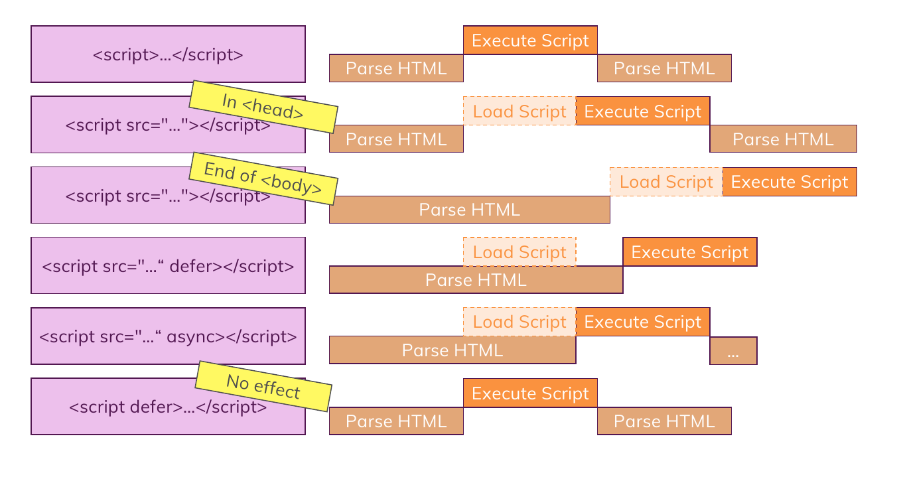

# About Javascript Code and Parsing and Executing it

## How To Import Javascript File? (Best Practice)

1. Import as an **`<script src=""></script>`** tag in the end of the head element in this situation browser will pause/block parsing the HTML file till all of the codes in the script files are downloaded to the browser and executed then it will continue to parse the rest of the HTML file **and its not good** , to solve this problem , you can use **`defer`** in script tag.
2. **`defer`** will tell the browser to download the javascript files but not to execute it till the parsing is complete and not block parsing HTML , so it guarantees us that it only executes the scripts once they were downloaded and once parsing HTML is finished so you can use it like this **`<script src="" defer></script>`**
3. We have also **`<script src="" async></script>`** which is similar to **`defer`** but it tells the browser to don't pause/block the parsing HTML just like **`defer`** but with a little difference , it won't prevent the engine from executing the javascript codes after downloading them while the parsing is not blocked. note that whenever the download is finished , the parsing is paused/blocked and the execution of the code begins in the end parsing will be continued. it's mostly used when the javascript code doesn't rely on the HTML elements and don't need to wait for the engine to parse them.
4. also in **`async`** mode the order of the execution is not guaranteed
5. all of the details up there is only available if and only if you have used the external javascript files with `src="./..."` attribute , otherwise if you put the javascript codes in the `<script>...</script>` it doesn't need to download so it will execute them first and `async` and `defer` attributes will be ignored



## Parsing and Order of Code Execution

1. You can define functions either in top or in other places of the code , because the js engine at first in the parsing phase , will begin to gather all functions and top and registers them , so **order does not matters for functions in the javascript code** but , **order matters for variables and constants**
2. If you connect multiple javascript sources to your html file , from top of the html to down of it , they will begin to parse and execute sequentially and you can access to functions and variables that are exists in previous files , unless you set **`async`** to script tag , then it will be unknown.

## Local and Global Scope

1. Take a look at this example :

```javascript
let global_scope_varible;

function add(num1, num2) {
  // this is global scope variable
  // and we can access to this inside the function
  global_scope_varible = num1 + num2;

  // this is local scope variable
  // we can't access to this variable outside the function
  let local_scope_variable = global_scope_variable;

  return local_scope_variable;
}

let output1 = global_scope_variable; // Correct
let output2 = local_scope_variable; // raise an error , not defined
```

It is better **Not to** manipulate global variables from inside of a function

## Number and Strings Convertions

```javascript
let number_int;
let number_float;
let string_int = "123";
let string_float = "12.5";

number_int = parseInt(string_int);
number_float = parseFloat(string_float);

// More Convinient Form : using +
number_int = +string_int;
number_float = +string_float;

// converting number to string
let str1 = number_int.toString();

let str2 = String(number_int);
```
