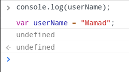
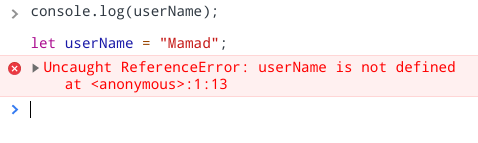

# Hoisting

Consider following code :

```javascript
console.log(userName);

var userName = "Mamad";
```

The output is :



Now lets change **`var`** to **`let`** and see the difference :

```javascript
console.log(userName);

let userName = "Mamad";
```

Let's see the output :



**So why is that ?**
Because of a feature called **Hoisting**

which means that the javascript engine , browser , when it loads the script , it goes over your entire script and it does things like look for functions which it then automatically loads and registers and you can declare it any where in your scripts , **and also** **it will do the same for variables which created with** **`var`**
and it actually **pulls** these **variables declaration** to the **beginning of your file** and **leave the initializations** at their places.

so the browser or the javascript engine do something with your code like this :


and what about hoisting with **`let`** and **`const`**?

The Javascript engine **also applies** this feature (Hoisting) for **`let`** and **`const`** too !

but the difference is in this situation the engine or the browser declares it at the beginning of your file but it doesn't initialize these variables with **`undefined`** like the var and they have no initial data so the error will be risen if you do this but for **`var`** it is different and the engine or the browser not only brings the declarations up but also set them to **`undefined`** for initializations

**With this feature , you are forced to declare and initialize your variables before you access them.**
