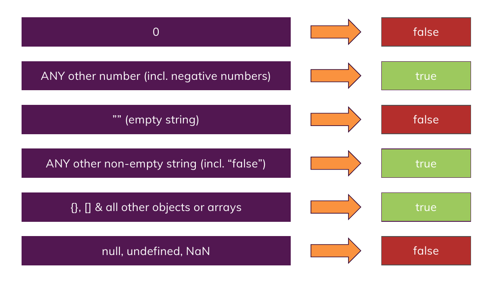
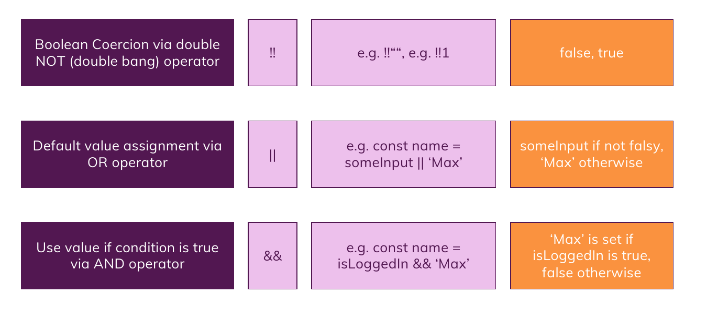

# Some Notes About Statements and Expressions

## Boolean Notes

1. in order to check for `NaN` , use built-in function `isNaN()` otherwise it won't work with `===` or `==` operators.
2. check this picture out (Coercing):
   
3. and also this (Making Real Boolean Values Out of things!):
   

## Statements vs Expressions

**What is the difference ?**

> An Expression is a piece of code that is going to end up with a value like : **`(a * b + 2)`**
> A Statement is a piece of code that is doing something for us like : **`if(condition) {. . .}`**
> We can put expressions instead of statements but not the reverse ! **so every expression is an statement but not the reverse and statements are just statements and not expressions !**
