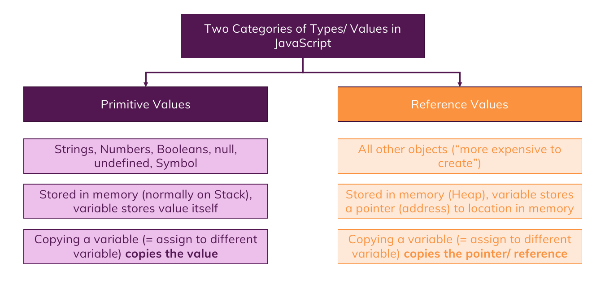

# Primitive and Refrence Values

**Just take a look at this summary :**



1. note that , the primitive values are also a kind of objects but they are called **pseudo objects** , but what is the difference ? the difference is they can be temporarily acting and become like objects , e.g. :

   ```javascript
   let name = "Mohammad Mahdi Mohajer";

   let name_len = name.length; // it has some built-in methods , is it an object ?
   // NOPE ! , it's an Pseudo Object.
   ```

2. when we assign a primitive value to a variable or constant , that variable or constant actually store that primitive value in their selves , but when you wanna to store a refrence value , you are not going to actually store the exact value in the variable or constant , instead you are actually saving the **address of that value** in the variable or constant.

    ```javascript
    let name = "mamad"; // in here , variable name really has the value of "mamad"

    const arr = [1, 2, 3]; // arr is containing the address of the value [1, 2, 3]
    ```

and it is the reason that we can't re-assign a new value to `arr` because in fact we are trying to assign a new address and because of the `const` , we can't do that but we can manipulate the values that this constant has their address in it.
