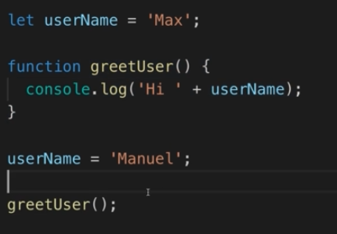
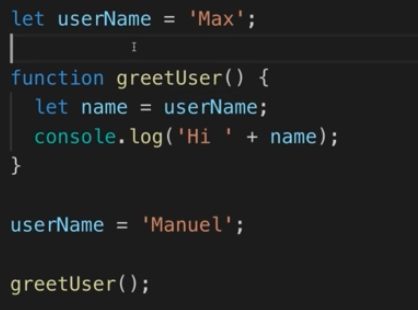

# Advanced Concepts

## Pure Functions & Side-Effects

1. A function is Pure if it has 2 major aspects:

   - If it doesn't have side effects which means doesn't have any effects on anything outside the function

   ```javascript
   let variable = 0;

   function impureFunction() {
     variable = 10; // changing outside variable make it impure
     return 2;
   }
   ```

   - If it produces a same out put every time for a same arguemnts that we pass in

   ```javascript
   function generateRandomNumber(seed) {
       ...
   }
   // this code will generate a random number every time for a certain seed
   ```

2. **NOTE** : Using impure functions is not bad and it is absolutely fine **but** try to have less impure functions as much as you can. it helps the code to be more predictable

## Factory Functions

1. What are them ? they are functions that can produces another functions

   ```javascript
   function createTaxCalculator(tax) {
     function calculateTax(amount) {
       return amount * tax;
     }

     return calculateTax;
     // notice that we are returning the refrenced value
     // which is the function it self
   }

   const calculator1 = createTaxCalculator(0.19);
   const calculator2 = createTaxCalculator(0.25);

   console.log(calculator1(100));
   console.log(calculator2(200));
   ```

## Closure

1. Every function in javascript is a **Closure** , now what is that being a closure then ?
2. Each function has its own lexical environment and there is also a global environment and the variables and constants are registered in these different environments you could say. Now when a function is created as we do it here with the function keyword by using this function declaration , then this function creates a new lexical environment and registers any variables that have access to this environment.
3. Every function in javascript is a closure because it closes over the variables defined in its environment and it kind of memorizes them.
4. Take a look at this :
   

   **The Output : "Hi Manuel"** , why ?

   Javascript actually registers the variable itself which is in the global environment(**`userName`**) in the function (**`greetUser`**) closure , **not the value of the variable** , so if you change the variable value , it will reflect the output and we will see that the output will be changed. every time it will get the latest value of that variable that is registered in that envrionment.

5. Another example :

   

   **The Output : "Hi Manuel"** , why ?

   This is the same as before, when we declare a new variable called **`name`** in the **`greetUser()`** function , then we assigned **`userName`** to this variable **BUT** this assignment will use the variable itself when we call this function not before the call i mean when we are declaring a function. and because every function is a closure , it stores (registers) the variable itself when we declare the functions not the values of them.

6. **To make it easy**, let's say that every variable that u use in the function closure , will be access during the calling the function operation and in that moment it will search to get the value of that variable. why? because it's closure ! , it will lock in any variables and everything that can refer to outside the function. and in the end , **functions remember the surrounding variables**

7. Final Note : Scope === Lexical Envrionment
