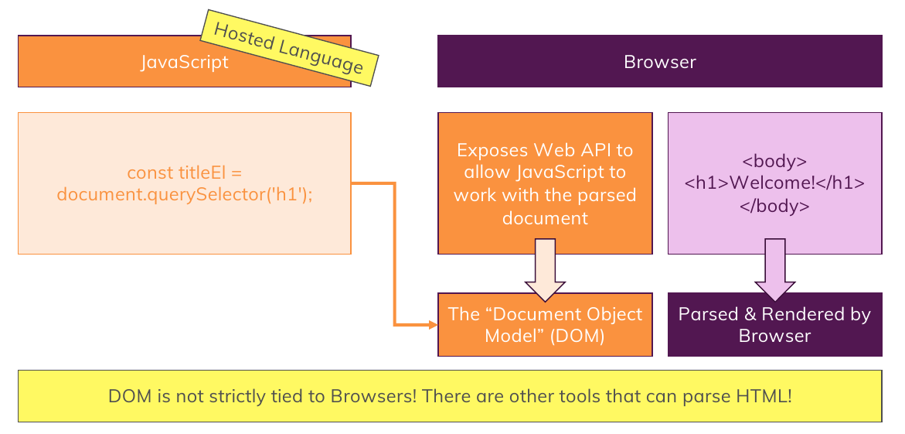
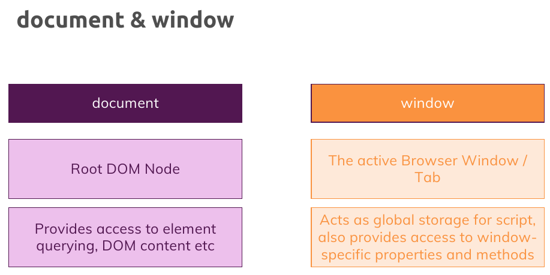
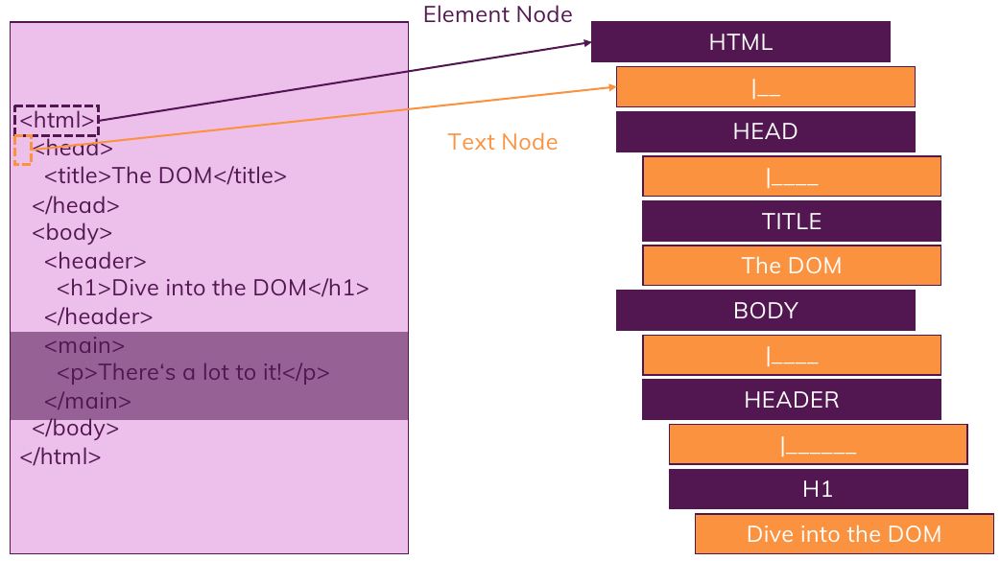
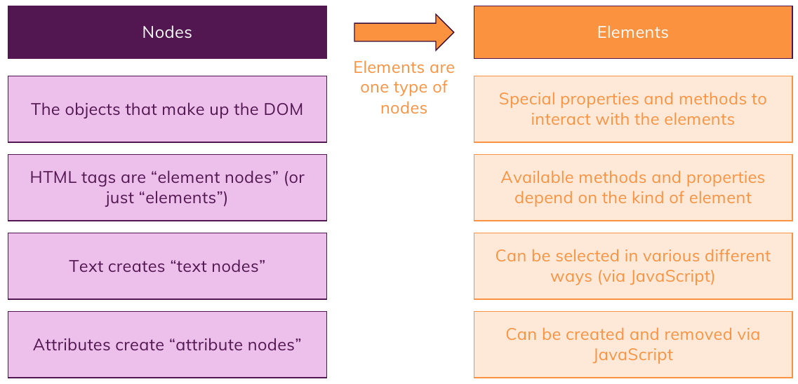

# Notes about DOM , BOM

1. First take a look at this :

   

2. we have 2 global objects to interact with top most **`window`** object and the top most HTML root object which is called **`document`**

   

3. by default you have access to the properties of the window object which is globally available like : **`window.alert()`** which can be called by **`alert()`** or even **`document`** object is also a property of **`window`** object which we can access to it directly

4. Types of Nodes in DOM :

   

5. For Summary :

   
