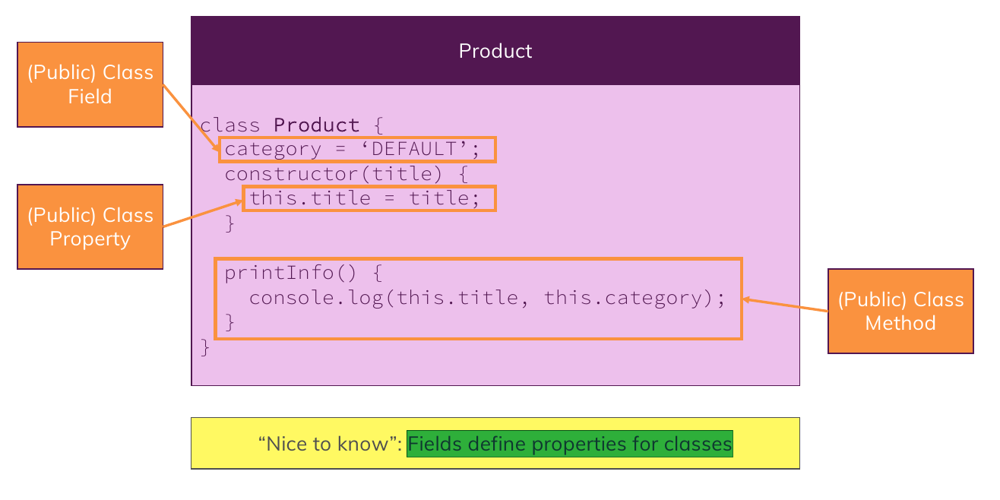
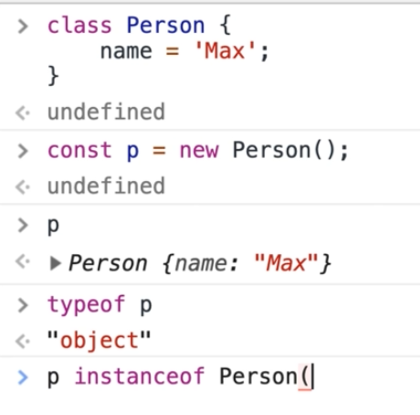
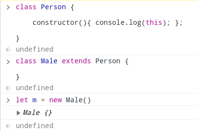

# Object Oriented Programmin in Javascript

## `Class` Keyword

1. Take a look at this sample codes:

   ```javascript
   class Product {
     // you should assign default value to your fields with '=' and end it with ';'
     title = "DEFAULT_TITLE";
     imageUrl;
     description;
     price;

     // adding a method to a class
     someNameMethod() {...}
   }
   ```

   It's just a Blueprint for creating our objects.
   How to use it and create objects ?
   See the following codes:

   ```javascript
   // new syntax -> calling the class like function ('Product()')
   // and put 'new' before to tell the javascript to create objects based on this class
   let prod = new Product(); // this gives us a new Product Instance or Object
   ```

   If you try to invoke **`Product()`** without **`new`** keyword , it will raise an error :

   

   Also, the created object is something like this :

   

2. Constructor Method inside a class :

   **Constructor method** will be called at the **beginning of the creation of the object of that class**
   **we can use it for setting initial values to the properties or fields and do some stuffs for the first time of creating the object**

   ***

   **NOTE** : we call them fields when we are in class context and then , we call them properties when we are in object context and in summary :

   

   > Fields define properties for classes

   ```javascript
   class Product {

     // You can omit these fields
     // and defines them in constructor method

     // title = "DEFAULT_TITLE";
     // imageUrl;
     // description;
     // price;

     someNameMethod() {...}

     // constructor
     constructor(title, imageUrl, desc, price) {
         // this refers to the 'Current Object' that is want to be created
         this.title = title ? title : "DEFAULT_TITLE";
         this.imageUrl = imageUrl;
         this.description = desc;
         this.price = price
     }
   }
   ```

   How to use ? See :

   ```javascript
   let prod = new Product(
     "Mobile Phone",
     "http://...",
     "Brand New Mobile Phone",
     2500
   );
   ```

   in the end , we have always normal javascript objects , it is not something different.

3. Static Methods and Fields in classes :

   ```javascript
   class Product {
     // this is a static field
     static fieldName;

     // this is a static method
     // we can access to this method via class itself
     static myMethod() {
       console.log(this); // this refers to the current 'Class'
     }

     // constructor
     constructor(title, imageUrl, desc, price) {
       // this refers to the 'Current Object' that is want to be created
       this.title = title ? title : "DEFAULT_TITLE";
       this.imageUrl = imageUrl;
       this.description = desc;
       this.price = price;
     }
   }
   ```

   in **Static Methods**, **`this`** refers to the **current class**.

   ***

   How to Use ? , See :

   ```javascript
   Product.myMethod();
   Product.fieldName;
   ```

4. Getters and Setters :

   ```javascript
   class ShoppingCart {
     items = [];

     get totalAmount() {
       const sum = this.items.reduce((prev, curr, items) => prev + curr, 0);
     }

     set cartItems(value) {
       this.items = value;
     }
   }
   ```

5. Class Inheritance

   ```javascript
   class Animal {
     constructor(name) {
       this.speed = 0;
       this.name = name;
     }
     run(speed) {
       this.speed = speed;
       alert(`${this.name} runs with speed ${this.speed}.`);
     }
     stop() {
       this.speed = 0;
       alert(`${this.name} stands still.`);
     }
   }

   let animal = new Animal("My animal");

   class Rabbit extends Animal {
     hide() {
       alert(`${this.name} hides!`);
     }
   }

   let rabbit = new Rabbit("White Rabbit");

   rabbit.run(5); // White Rabbit runs with speed 5.
   rabbit.hide(); // White Rabbit hides!
   ```

6. fields that were defined in a class can only be accessible after the **`super()`** (parent constructor) is called, it means the fields are translated to properties after the **PARENT** constructor ran. otherwise you should pull them into another method , something like **`fetchData`** and set the datas in this function and then try to render items in that. this can be really helpful when you are also working with fetching datas from a server. **(Very Helpful)** , also another approach is try to hold the rendering somehow !
7. If you don't define any constructor method in child classes , it will automatically call parent constructor by default and if you explicitly define a constructor method for the child class , you should always first call **`super()`** which is **parent class constructor method** , otherwise , **it will raise an error.**

8. Encapsulation

   ```javascript
   class ProductList {
     // wanna make private field
     #products = []; // private field

     someMethod() {
       // accessing private field inside of a method
       let prod_list = this.#products;
     }

     // wanna make private methods
     #privateMethodField1 = () => {};

     #privateMethodField2 = function () {};
   }
   ```

9. Pseudo-Private Properties
   The addition of private fields and properties is relatively new - in the past, such a feature was not part of JavaScript.

   Hence you might find many scripts that use a concept which you could describe as "pseudo-private" properties.

   It would look like this:

   ```javascript
   class User {
     constructor() {
       this._role = "admin";
     }
   }

   // or directly in an object

   const product = {
     _internalId: "abc1",
   };
   ```

   **What's that?**

   It's a quite common convention to prefix private properties with an underscore (**`_`**) to signal that they should not be accessed from outside of the object.

   Important: It's just a convention that should signal something! It does NOT technically prevent access. You CAN run this code without errors for example:

   ```javascript
   const product = {
     _internalId: "abc1",
   };
   console.log(product._internalId); // works!
   ```

   It's really just a hint that developers should respect. It's not as strict as the "real" private properties introduced recently (**`#propertyName`**).

10. instanceof Operator

    

11. When you use **`this`** in some method of the base class , if you then called it on the object that is based on the subclass , this in the base class will refer to the concrete object on which you called it not on the base class. **IT IS VERY IMPORTANT**
    
    
12. Overriding of methods will act as the same as other languages typical class-based inheritance , which means if you **override a method in child class** , it **will use that method (in child)** even if you **call it in the constructor of parent class**.
 
13. The **order of class field initialization**, as defined by JavaScript for the following code, is:
      ```javascript
      class Base {
        name = "base";
        constructor() {
          console.log("My name is " + this.name);
        }
      }

      class Derived extends Base {
        name = "derived";
      }

      // Prints "base", not "derived"
      const d = new Derived();
      ```
      
      1. The base class fields are initialized
      2. The base class constructor runs
      3. The derived class fields are initialized
      4. The derived class constructor runs
      5. This means that the base class constructor saw its own value for name during its own constructor, because the derived class field initializations hadn’t run yet.

14. In most of the other programming languages (e.g. **Python**) which are using **class-based inheritance** , you can consider the inheritance process as creating a quiet new class which has the properties and methods of parent class. It means at first, you can imagine it as copying all of the properties and methods of the parent class right into the child class and then the overrided fields and methods will replace the old ones, that is how we come up with a brand new class which is descendant of the parent.
15. just notice that in **class-based inheritance** , field and methods of the class will be overriden and taken place in the new class at the **Compile-Time** while in the **prototype-inheritance** , it is done at the **Runtime**. Why is that ? because of the javascript performance in the browser with prototype-inheritance is much more better than class-based inheritance and its implementation is much more convinient and easier than the other approach.

---

16. Summary / Inheritance : Order of Initializing:
      1. Methods/Getter/Setter : in **Both** Parent and Child
      2. Parent Fields
      3. Parent Constructor : ( **Super()** in Child Constructor )
      4. Child Fields : ( **After** executing **Super()** )
      5. Child Constructor : ( Lines of code after Super() )

17. Best Practices:
      1. Do not access **Child Fields** inside **Parent Constructor**
      2. Do not access **Child Methods** inside **Parent Constructor**
      3. Do not use **Child Fields and Methods** inside **Parent Methods or Expressions**
