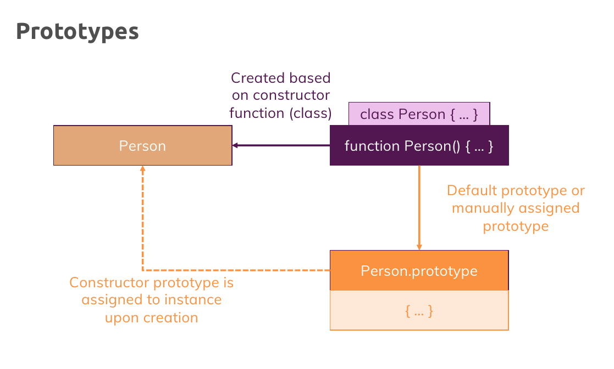
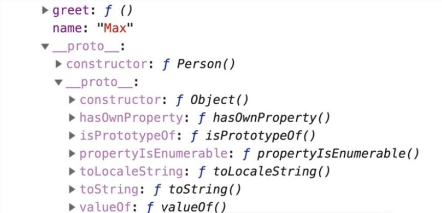
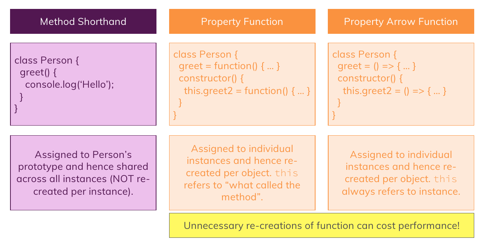

# Prototypes

1. Every constructor function you build has a special prototype property **which is not added to the objects you create based on it** because **it is not** part of the constructor function body **BUT** a property of that **function object** and that prototype is there by default , you can edit it and it is then automatically assigned **as a prototype** to the object when you instantiate that constructor function.

   

2. Prototypes are like **"Fallback Objects"** , and what does it mean ? every object in javascript has a prototype and a prototype is a basically a connected object which is used as a fallback object and this prototype object also has its own prototype object and makes a chain of prototypes

   

   if javascript tries to access a certain method or property and doesn't find it on an object , it automatically looks at the prototype object and looks for the property there and if it doesn't find it there , it looks at the prototype of that prototype, all the way until it reaches the end of that chain and didn't find that property or method , which returns **`undefined`** for properties or raises an **`error`** for methods.

   
   

   Note that the constructor method or the constructor function will be placed into the prototype not the direct properties , i mean **`__proto__`**.

3. When you use **constructor functions** , there are two properties that you may see :

   1. **`functionName.prototype`**
   2. **`functionName.__proto__`**

   the first one is the object that will be set as the prototype of every other object that want to be created by this constructor function , i mean like this :

   ```javascript

   function functionName() {
       ...
   }

   let obj = new functionName();

   // it prints "true" because they are the same
   console.log(obj.__proto__ === functionName.prototype)

   // and also we can change this prototupe of this function too

   functionName.prototype = {
       someMethod(){
           ...
       }
   }

   let new_obj = new functionName();

   ```

   the second one is the actual prototype or callback object of the current function object. as you know , functions are also objects and they should have been created based on a specific prototype and that prototype which they have built based on it is **`__proto__`**

4. Every objects that is built by default has the prototype of **`Object.prototype`** it means :

   ```javascript
   let obj = {...}

   console.log(obj.__proto__ === Object.prototype); // logs true
   ```

5. Methods in classes will be placed in the prototype of the object when we instantiate : **`__proto__`** and the **fields** will be translated to **properties** in **object it self** , because of **optimizations** when you are instantiating many objects of the same class, with this approach , we won't create method objects for each of the instances instead it will be placed in prototype (**`__proto__`**) and does not need to be created again.

   

6. You can change (setting) the prototype of objects that you created and the prototype of objects that still not being created but want to create them without your constructor function and with a different prototype

   ```javascript
   let person = {...};

   let proto = Object.getPrototypeOf(person); // returns the prototype of person object (person.__proto__)

   let customProto = {...}

   // it will change the prototype of person object
   // and set it to customProto object
   Object.setPrototypeOf(person , customProto); // person.__proto__ === customProto -> true


   // creating the object and setting its prototype before the creation
   let customProto2 = {...};
   let student = Object.create(customProto2);

   ```
