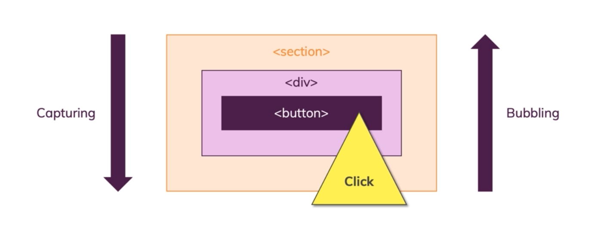

# DOM Events

1. To Add and Remove Event Listeners :

   ```javascript

   const div = document.querySelector("div");

   const callbackfn = () => {...};

   // to add
   div.addEventListener('click' , callbackfn);

   // to remove
   div.removeEventListener('click' , callbackfn)

   ```

   Just know this you should exactly pass the same callback function with the same refrenced value for function object and the same event to perform removing operation.

2. **Capturing** and **Bubbling**

   

   - **Capturing** means the checking (Listening) for DOM events is started first **from the outside elements to the inside ones**
   - **Bubbling** means the opposite of Capturing, it means it starts the checking **from the inside elements to outside ones**

3. By default , all event listeners are registered in the **Bubbling Phase**
4. to change the default behaviour which is listening bubbling phase first to listening capturing phase first , we can do this :

   ```javascript
   const div = document.querySelector("div");

    // the second argument of addEventListener method is false by default
    // you can pass true to switch to capturing mode from bubbling
   div.addEventListener('click',event => {...} , true)
   ```

5. **To stop default behaviour** of triggering an event in the browser you can use :

   ```javascript
   event.preventDefault();

   // for example in click event for submit button in a form ,
   // it will force browser to refresh the web page but with this ,
   // we can stop the browser from refreshing.
   // it can be varies from one element to another
   ```

6. Another term is **Propagation** : when we have multiple event listeners on a same event like **`click`** event by multiple elements , the default behaviour as we said is the bubbling mode which means the event will be listened first from the inside elements to outside ones. but the point is the event does not just trigger on the inside element it self but also on ancestors too , that's called **Propagation**. it means that the event propagates up , it bubbles up or in the captuire phase it kind of goes from outside to inside but it basically means the event does not just occur on the element it self, but also on all ancestors or at least we can listen on all ancestors. like this picture :
   

   the event **`click`** is occured on the inside element which is **`button`** but it is also listenable on all ancestors because it propagates up (bubbles up) , and in capturing mode it behaves oppsoite but with the same logic.

7. We can prevent (stop) the event propagation on the elements using this method :

   for example we wanna to listen to the **`click`** event on the button and we only want that this event only occurs on the button element not the ancestors. maybe we don't want to trigger click handlers of its ancestors like **`div`** and **`section`** , maybe they should perform something that they don't need to do when we click on inside button. so we must **STOP The Propagation** and we can use this approach:

   ```javascript
   event.stopPropagation();
   ```

   It is completely different from **`event.preventDefault`**.

   There is also another method which is used when we have multiple event listeners on the **same element**. consider a situation when we have 3 eventListeners on the **`button`** element and we only want to trigger the first one so we should stop the propagation of the event after triggering the first event handler. so we can do this

   ```javascript

    const div = ...;

    div.addEventListener('click',event => {
        event.stopImmediatePropagation();
        ...
    })

    // these two will not be triggered

    div.addEventListener('click',event => {
        ...
    })
    div.addEventListener('click',event => {
        ...
    })
   ```

8. You should also note this that **not all events propagate**.

9. **Event Delegation** : Consider the following code:

   ```html
    <ul class="list">
        <li>
            <h2>Item 1<h2>
            <p>Paragraph 1</p>
        </li>
        <li>
            <h2>Item 2<h2>
            <p>Paragraph 2</p>
        </li>
    </ul>
   ```

   You want to write a code which performs the changing the background color of every element you clicked in the list to red. instead of adding event listener on every list item you can add one event listener on **`<ul>`** element and get benefit of propagation feature of events. This is called **Event Delegation**.

   ```javascript
   const ul = document.querySelector(".list");

   ul.addEventListener("click", (event) => {
     event.target.style.backgroundColor = "red";
   });
   ```

   so what will happen if we click on an inside element , something like the first **`h2`** tag ?
   The important thing in here is the property **`event.target`**. so what element does this property, i mean **`.target`** refer to ? the answer is **The property which is propagating the event to the outside elements** , and because we have an event listener on the outside element which is **`ul`** , we can listen to this propagated event with its origin target. so this background will apply to the its origin target which we clicked so it will change the color of **`h2`** tag and it is correct for the same cases.

   And also it is good to know this , there is another property called **`.currentTarget`** which returns the element that the event listener has been added to it. this means :

   ```javascript
   const ul = document.querySelector(".list");

   ul.addEventListener("click", (event) => {
     // event.currentTarget is ul element
     event.currentTarget.style.backgroundColor = "red";
   });
   ```

   There is also another property called **`relatedTarget`** , it shows the opposite target of **`event.target`** based on the relation of that event. for example : on **`mouseenter`** event , the entered element is **`event.target`** , and the exited (leaved) element is **`event.relatedTarget`** and for **`mouseleave`** it is the opposite.

10. How to trigger an event programmatically ?

    ```javascript
    const btn = document.querySelector(...);

    // triggering the click event programmatically

    btn.click();
    ```

11. **`this`** in the event listeners that use normal functions (**arrow functions does not bind this to anything**) :

    ```javascript
    const ul = document.querySelector(...);

    ul.addEventListener('click' , function (event) {

        // this will give the <ul></ul> element
        // btw : it always return the currentTarget
        // not the target !
        console.log(this);
    })
    ```
