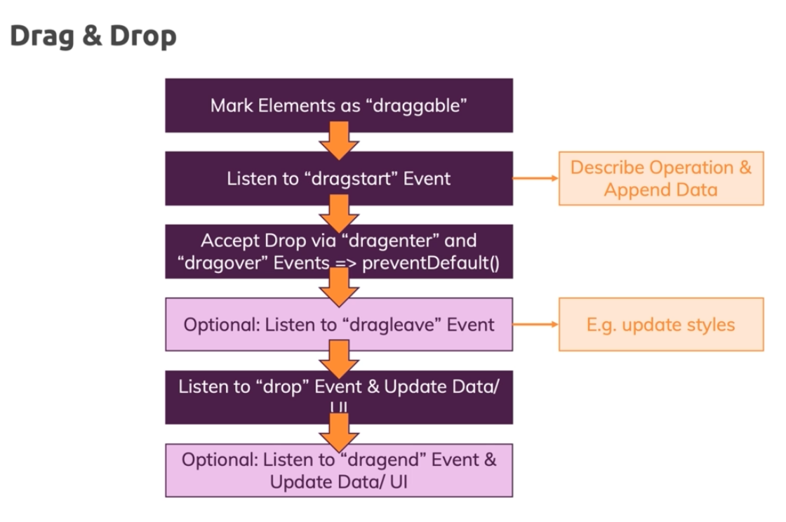

# Drag and Drop

1. The default behaviour of the browser is to reject and cancel the drop event , then you should always change the default behaviour via **preventDefault** in the third step , unless the drop will not be accepted
