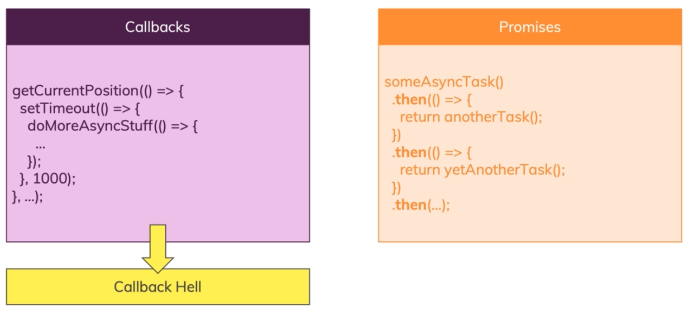
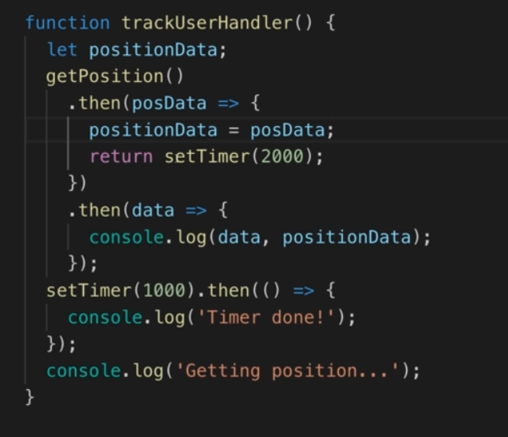

# Asynchronous in Javascript

## Intro

1. First of all , know this that javascript is **single-threaded**. that's it !
2. So what is async exactly in javascript ? how can we handle the operations that can take a bit longer than the other and we want to run the rest of the codes asynchronously ?
   **The answer is we can offload them to the browser !** because the browser is able to use multiple threads . one for javascript and one for another task like the async tasks declared in javascript. so the execution is not blocked and the browser is resposnible for executing the async tasks and manage them in multiple threads.
3. How Javascript communicate with browser ? through defining call back functions and work with appropriate API like Browser API with help of Event Loop. **So The Real Magic Is Done By The Browser With Help Of Event Loop !**

## Event Loop

1. Take a Look at this picture:

   

   It is actually the **Event Loop** that helps us with asynchronous codes and let us deal with calback functions which are used in such async codes. note that event loop is not part of javascript engine , it is really part of the host environment of javascript like browser or webserver and etc ...

2. When ever an async task is going to execute for example a timer after a certain amount of time or a response of http request , it will schedule for execution in Message Queue which is provided by the Browser or Host Environment. these messages are like TODO tasks for javascript.

3. What does **Event Loop** really do?
   The job of **Event Loop** in the end is to synchronize the call stack in the engine with our waiting messages. in the end event loop runs basically all the time and it always sees , is the stack empty and do we have pending tasks in queue or TODO Tasks? and if there were any ? it will push any waiting messages or any TODO functions or tasks therefore into the call stack after Javascript engine call stack becomes empty.

## Promise

1. First, take a look at this example to know that what problem do promieses fix :
   

   So what exactly the promise is ?

2. Promise is a cleaner way to use asynchronous tasks and callbacks that really helps us to avoid the **Callback Hell**. We can avoid nesting and implement our step by step guideline instead of step in a step in a step and so on.
3. Promise has 3 states :
   1. Resolve
   2. Reject
   3. Pending
4. How to create Promises ?

   ```javascript
   // resolve and reject are both functions
   const promise = new Promise((resolve, reject) => {
     `a callback function which is executed right away
      when this promise is constructed.
      and it's a way for us to configure what this
      promise should actually do`;

     // some async task
     // like : setTimeOut(() => {...}, timeout)

     setTimeout(() => {
       resolve("someData");
     }, timeout);
   }).then(resolveFunction, rejectFunction);
   // -> data => {...}
   // -> error => {...}
   ```

   Where can this promise be useful ? See the code below:

   ```javascript
   const setTimer = (duration) => {
     const promise = new Promise((resolve, reject) => {
       // put asynchronous task here
       setTimeout(() => {
         resolve("someData");
       }, duration);
     });

     // most important part
     // we return the promise to set the resolve and reject functions
     return promise;
   };

   setTimer(2000).then(
     (data) => {
       console.log(data);
     },
     (error) => {
       console.log(error);
     }
   );
   ```

   Also , for error handling , we can use an alternative too , because passing two callbacks to then method is not the best practice. So we can do this :

   ```javascript
   setTimer(2000)
     .then((data) => {
       console.log(data);
     })
     .catch((error) => {
       console.log(error);
     });
   ```

5. Note that promises are considered as async tasks and what ever they are and how fast they wanna be execute , they will be passed to browser to handle them and Javascript goes for the next lines and codes.

6. Promise Chain :

   

   The core idea of promise chaining is to return another promise in **`.then(...)`** method and declare another **`.then`** method for the returned object which is also a promise and it is creating a chain of promises which we can use to do tasks step by step and avoid nesting the tasks especially asynchronous tasks.
   When you use chaining , the later steps or later then methods will execute if the previous ones has been executed, because it is a chain of promises, if one ring falls , the rest of the rings of the chain will be.

7. Error handling in Promise Chain:

   1. First of all , you need to know that , if in a promise chain , we see an error in for example one of the chains , it directly goes to the **nearest** (nearest from the top or beginning) **`.catch()`** or **second argument error handler** (2 ways of declaring error handlers) and execute that handler function which is **`rejectFunction`** , and ignore the rest of the **`.then()`** methods before the **`.catch()`** or **second argument error handler**.
   2. **But** it will continue to execute the remaining **`.then()`** methods that is comming after that **`.catch()` or second arg error handler**.

   ```javascript
   const prom = setTimer(2000)
                  .then()
                  .then()
                     .
                     .
                     .
                  // go and execute this
                  // if we see an error in the above chains
                  .catch(err => {...})
                  // these methods will also be executed
                  .then()
                  .then()
                     .
                     .
                     .
                  .then();
   ```

   If you wanna make the chain something like if you see an error , the whole chain stops , you should move the **second arg error handler or `.catch()`** to the end of the chain. Like this :

   ```javascript
   const prom = setTimer(2000)
                  .then()
                  .then()
                     .
                     .
                     .
                  .then()
                  .then()
                     .
                     .
                     .
                  .then()
                  .catch(err => {...});
   ```

8. Note that in promise chain , if we have a scenario like this :

   ```javascript
   const prom = setTimer(2000)
                  .then() // 1
                  .then() // 2
                  .then() // 3
                  .then() // 4
                  .catch(err => {...}); // 5
                  .then() // 6
                  .then() // 7
                  .then(); // 8
   ```

   If we have some errors in chain number 2 (`// 2`) for example , it will jump to **`catch`** which is number 5 and execute the **`catch`** method and ignore the previous **`then`** statements. and after that , it will continue and execute the rest of the chain , i mean number 6 , 7 , 8.

   ***

   Now if we have an error in chain number 7 , **It will not jump to the catch method that was previous in number 5 and the whole chain will be stopped because of that error which we did not catch it**.
   So if you wanna the promise chain continues , **you should add another catch phrase in the continue or at least at the end of the chain**.

   So if you don't set **`.catch()`** or **second arg error handler** and if you have errors in somewhere , it will raise that error and stop the promise chain , but if you set these 2 functions , it will jump into them when we have errors and continue to run the other **`.then()`** statements after that catch rather than previous ones. and for the upcoming probable errors you must have another **`catch`** after the first **`catch`**.

   ***

9. **Summary of Promise Chains**

   You learned about the different promise states:

   **PENDING** => Promise is doing work, neither then() nor catch() executes at this moment

   **RESOLVED** => Promise is resolved => **`then()`** executes

   **REJECTED** => Promise was rejected => **`catch()`** executes

   When you have another **`then()`** block after a **`catch()`** or **`then()`** block, the promise re-enters **PENDING** mode

   ***

   **Keep In MInd: `then()` and `catch()` always return a new promise - either not resolving to anything or resolving to what you return inside of `then()`**.

   ***

   Only if **there are no more then() blocks left**, it enters a new, final mode: **SETTLED**.

   Once **SETTLED**, you can use a special block - **`finally()`** - to do final cleanup work. **`finally()`** is reached no matter if you resolved or rejected before.

   Here's an example:

   ```javascript
   somePromiseCreatingCode()
     .then((firstResult) => {
       return "done with first promise";
     })
     .catch((err) => {
       // would handle any errors thrown before
       // implicitly returns a new promise - just like then()
     })
     .finally(() => {
       // the promise is settled now - finally() will NOT return a new promise!
       // you can do final cleanup work here
     });
   ```

## Async & Await

1. You can use the alternative way for using promises and extend your functionalities and have much more cleaner codes using **`Async/Await`**.
2. We saw that you should wrap your async task with a promise and use resolves and rejects , now you can do another thing , put **`async`** behind the function declaration and it becomes an **asynchronous function** and will always return a **Promise** and **if you have any return values in async function , it will wrapped in a promise.**
3. The body of an async function is always wrapped in a new Promise. If the return **value** is primitive, async functions return a **promise-wrapped version of the value**. However, when the return value is a **promise object**, its resolution is returned in a **new promise**

   ```javascript
   async function setTimer(duration) {

     await somePromiseCreator();
     await asyncTask();
     ...
   }
   ```

4. Async / Await does not change the way Javascript works or executes , it just transforms this code behind the scenes. **`await`** will not make javascript stop for executing that promise instead it will transform that into the promise chain version
   An **`await`** acts on an expression. When the expression is a **promise**, the evaluation of the async function halts until the promise is resolved.
   When the expression is a **non-promise value**, it is **converted to a promise** using **`Promise.resolve`** and then resolved.

   Here is the example:

   1. Here is the version for example using Async / Await and not using Promises:

      ```javascript
      async function trackUserHandler() {
        const postData = await getPosition();
        const timerData = await setTimer(2000);
        console.log(timerData, postData);
      }
      ```

   2. And this is the most likely (not the exact) transformed version behind the scenes to Promises:

      ```javascript
      function trackUserHandler() {
        let posData;
        let timerData;

        getPosition()
          .then((positionData) => {
            posData = positionData;
            return setTimer(2000);
          })
          .then((data) => {
            timerData = data;
          });
      }
      ```

5. Check these methods too , it's easy:

   ```javascript
   // race between multiple promises and
   // returns the promise which resolves or rejects sooner than the others
   // notice that the other promises will also continue to resolve or reject
   // but their output will be ignored but they will not be cancelled.
   Promise.race(array_of_promises)
           // this data is the data of the promise
           // that is resolved or rejected
           .then(data => {...});

   // resolve only when all of the promises in the array resolves
   // if one promise rejects , it will not wait for other promises to resolve or reject
   // and it goes to error handler
   Promise.all(array_of_promises)
           // this data is the 'Combined Data' of the promises
           // that are resolved or rejected
           .then(data => {...});

    // like .all() but will note cancel the execution of other promises
    // and in the end it will give you a brief summary of the execution of the promises
    // that which promise resolved or rejected
    Promise.allSettled(array_of_promises)
           .then(data => {...})
   ```
