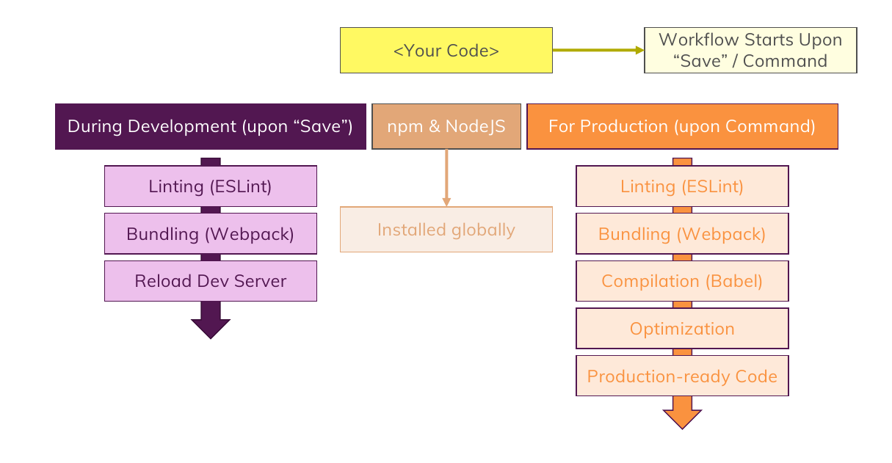

# Javascript Modules

1. By default in JS , when we import files from **`<script>`** tag before the main file , they will import and available in the global object but when we are using modules , this will change and then every file will be locked down , its content will not be added to this global , it will not globally be available. **The solution is `export` keyword**. this keyword will make the file be available to access for otherfiles.
2. You should add **`type="module"`** attribute to the **`<script>`** tag :

   ```html
   <script src="..." type="module" defer></script>
   ```

3. Syntax:

   ```javascript
   export someObject

   export default anotherObject

   import defaultObject , { moduleName as alias } from "./path/to/moduleNameFile.js";

   import * as bundleModuleAlias from "./path/to/moduleNameFile.js";
   ```

   Webpack imports does not need file extensions (**`.js`**) at the end of import:

   ```javascript
   import defaultObject, {
     moduleName as alias,
   } from "./path/to/moduleNameFile";
   ```

4. Dynamic Import:

   ```javascript
   // use import as a function , it will return a promise

   import("path/to/module.js").then((module) => {
     const obj = new module.moduleNameFile();
     ...
   });
   ```

5. Code in your modules **runs** when the module is imported and loaded **for the first time** and that is very important , so **if you import from a module , multiple times , it will run only once !**

6. In the past when you define a global variable it would invisibly automatically be added to the window object which acted as a **global object**.
   but **in the modules** , we have **modules scope** and **they are not global** but we can access **`window`** object which is global object but **`this`** will not refer to this object unlike the past!
   so if you have some constant variables in another file and you want to access to them , you can't easily import them , **you should add them to the global object `window`**:

   ```javascript
   // Component.js
   class Component {
     run() {
       console.log(window.DEFAULT_VALUE);
     }
   }
   ```

   ```javascript
   // app.js
   import Component from "path/to/Component.js";

   window.DEFAULT_VALUE = "Mamad"; // make it globally available

   const cmp = new Component();

   cmp.run(); // "Mamad"
   ```

   try to use this method as less as possible and only when it is critical to share some data globally.

7. There is another thing called **`globalThis`**.
   in modules , **`globalThis`** replaces **`this`** as your pointer at the window object because **`this` inside of modules is not defined**.

8. **Imports** are automatically **hoisted** and sorted to the top

9. Final Notes :

   1. This section was all about the utilites that the browser and JS engine within the browser can make use of.
   2. Many utilities such as **Bundling** , **Code Optimizing** , **Code Compilation** , **Development Server** , **Linting** and ... are available through **Node.js** and the packages that it can use. for summary take a look at this picture :

      

   so you should make use of **Node.js** and initialize the Javascript Project with **`npm init`** and make use of node.js packages in **`node_modules/`** in your machine.

10. To initialize a Javascript project follow these steps :
    1. `npm init` in the project folder
    2. install tooling and bundling packages like : **webpack**
    3. install linting : **eslint** , **jshint** , ...
    4. install code compilation for browser support : **babel**
    5. install dev servers : **serve** m **webpack-dev-server**
    6. install utility packages : **lodash** , **axios** , ...
