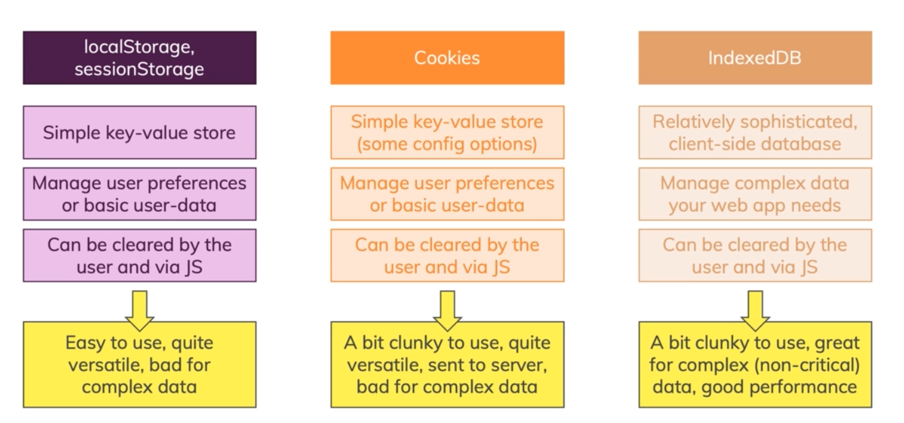

# Browser Storage

1. Take a look at this :
   

2. **Cookies** unlike Local Storage and Session Storage typically are sent to the server with outgoing HttpRequests and can be read by the server because they are attached to outgoing request in the headers.

3. **Session storage** data lives as long as your page is open in the browser. so it will live as long as you have active tab even if you reload the page. but when you close that tab or window , it will be cleared **but local storage won't**.
