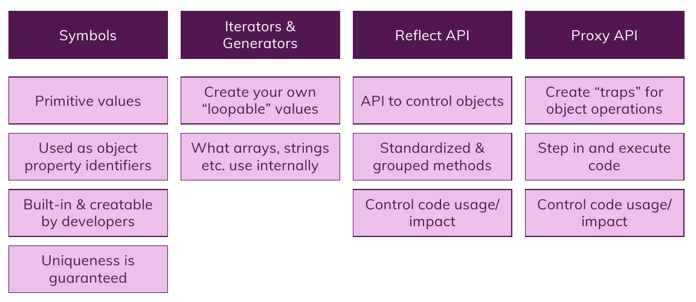

# Meta Programming

## Summary

### IMPORTANT NOTE

Learn these functionalities **whenever you need them.**
They are useful in some **niche cases** and their application **can not be witnessed by everyone.**
